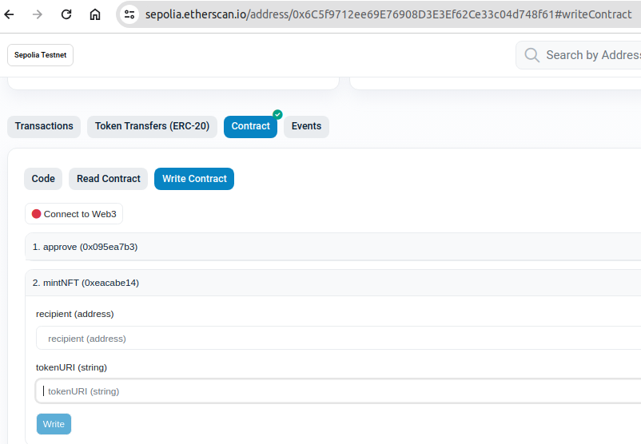
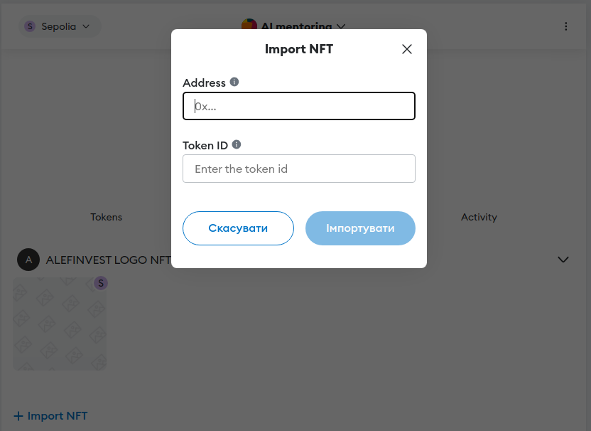

# NFT

NFT solidity smartcontract deployment

## Sepolia ETH faucet

 In order to deploy our smart contract to the test network, we’ll need some fake ETH. To get ETH you can go to the [Sepolia Faucet](https://sepoliafaucet.com/) hosted by Alchemy, log in and enter your account address, click “Send Me ETH”. You should see ETH in your MetaMask account soon after!

## .env

``` bash
MNEMONIC='your recovery phrase for metamask wallet to be used for truffle migration on sepolia and for smart contracts verification'
PROJECT_ID='your infura api key:[https://app.infura.io/dashboard] To be used with Ethereum Sepolia Test Net'
ETHERSCAN_API_KEY='your etherscan api key'
```

## Bash history

``` bash
1323  truffle init
1327  npm init -y
1328  npm install @openzeppelin/contracts
1329  truffle compile
1330  npm install @openzeppelin/contracts@4.9.3
1331  truffle compile
1335  npm install @truffle/hdwallet-provider
1336  truffle migrate --network sepolia
1337  npm install truffle-plugin-verify
1338  truffle run verify AINFT --network sepolia
1341  truffle run verify AINFTLOGO --network sepolia
```

## HOW TO RUN

1. Create .env file with your credentials.
2. Perform migration on sepolia network.
3. Verify contracts on sepolia network.
4. Minting NFT ERC1155 in AINFT.sol is done during migration
5. To mint NFT ERC721 in AINFTSECOND.sol you need to go to https://sepolia.etherscan.io/ to your verified smart contract to and execute transaction with your connected web3 metamask wallet.  You need to specify desired sepolia `recepient` address to mint NFT there and specify `tokenURI` e.g.(https://alefinvest.xyz/nft/logo/100) and click Write button (then confirm transaction in your metamask wallet) and wait for transaction to be mined.
6. To make visible AINFTLOGO-ERC721 or AINFT-ERC1155 in your metamask wallet you need to add  deployed smartcontract address manually in metamask NFT tab .

### Migration

``` bash
0  npm install
1  truffle migrate --network sepolia
2  truffle run verify AINFT --network sepolia
4  truffle run verify AINFTLOGO --network sepolia
```
